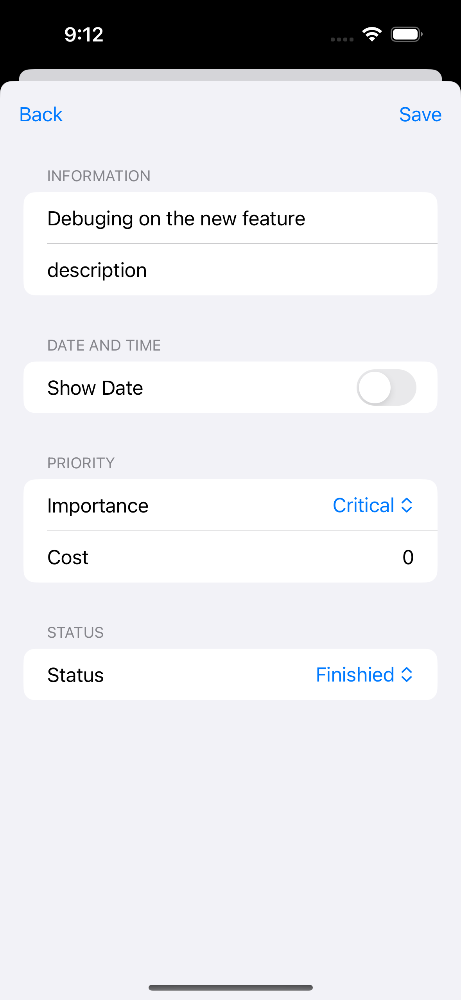

# Hierarchy To-Do List
Proudly developed by Jamie Liu and Jordan Han from Duke University.

## 1. Introduction 📖
Going through the efficiency apps on the market, we found that most of the to-do list applications only take the tasks as a single "Burn after Reading" task. However, sometimes when we need to organize the tasks, it can be difficult to review the previous work.

Hence, we want to build a to-do list that is clearly structured, well organized and fully visualized. 

Here's how we gonna achieve our goals:

**☑️Clearly structured**: We applied a Epic-Story-Task hierarchical structure to categorize the tasks. With such a structure, we can manage our tasks in a way such as ECE564-Homework1-Read the Swift Documentation.

**☑️Well organized**: In the Task List View, you can see all the available tasks in an order that's according to Priority. We introduce four priority type: 

- Default: by the order of task created time
- Importance: by the order of task's importance
- Time: by the order of the remaining time to due time
- Priority: by the order of Priority value, which is Priority = 2.5 x Importance + 2.5 x Time Factor

**☑️ Fully visualized**: We use graphs to visualized the time distribution on each Epic, so that users can see how they arranged their time in the previous period and better improve their efficiency. Besides, we also uses a data visualization on the task list to add a countdown to the close-due tasks so that the user can hurry up.

## 2. Basic Functions 🔨

### 2.1Add a new Epic, Story or Task

#### 2.1.1 Add from Backlog

- For new Epic, you can click the "+" button on the top of the Backlog page, and there will be a new Backlog at the bottom.

- For new Story and Task, you can swipe left on the target upper Epic or Story, and there will be a new Story or Task created.

#### 2.1.2 Add from Task List Page

Some of our users might not need to make every task into a hierarchical structure. Hence, we provide a fast task creation method:

The user can easily create a task by clicking the "+" button on the top of Task List Page. There will be a textfield at the bottom of today's tasks. If the user type in the new task's name and click "Add" button, a new quick task will be created.

### 2.2 Edit the information of Epics, Story or Task

If you want to edit the information, you can either: 

- Perform a quick-modification by tapping on the name of the Epic/Story/Task. Type in the new name you wanna use and press Enter to confirm the modification.

- Perform a more specific modification by swiping right on the specific Epic/Story/Task. Click on the Edit button to go to the edit page. 

### 2.3 Delete a Epic, Story or Task

You might have understood how to do it. 

Yes! Just swipe right and click the red delete button!

## 3. Features ✨

### 3.1 Near Due Countdown

To let users be notified when a task is close to the due time, we added a visualization on the Task List Page. 

When the task is one hour to the due time, the task name will be in red-black gradient color, and there will be a countdown clock behide the task name. Therefore, user can know that it's time to hurry up!

### 3.2 Data Visualization

In order to help the users to better manage their tasks and manage their time, we use pie chart to visualize the time they spent on each epic in the Me Page. 

By clicking on each portion of the chart, user can see the name of the Epic and the time portion it occpied.

### 3.3 iCloud

We support an iCloud storage to ensure the security of user's data. User can go to the setting page to choose whether he/she wanna use automatic iCloud synchronization.

- In Auto Sync mode, every modification to the data will be uploaded to iCloud.

- In Manual Sync mode, users can manually upload to or download from iCloud.

### 3.4 Calendar

To better allow users to manage their schedule, we can let users to put their task in our app to Calendar.

They just need to select Show in Calendar, and you can see the task in the Calendar. You can also show the task in reminder in the same way.

### 3.5 Automatic Task List Order

As we introduced before, we support four different priorities.

Here's how it looks like if the user chooses Default, Importance, Time and Priority mode correspondingly.

### 3.6 Focus Clock

If the user wanna focus on certain task, we provide a focus clock that can count down from a chosen time.

User only need to choose the task on Task List Page, swipe left and choose the play button to start a focus clock. 

Once they enter the clock, they can click on the little clock button to set the time, and start the clock.

### 3.7 Firework Effect 🎉

To praise the user for getting a new task done, we made a firework effect. It is basically made of SwiftUI's Circle shape and annimation.

### 3.8 User Information

When planned to allow users to login using their appleID. However, this function requires a developID to test it. Hence, we use a button to choose whether the user uses appleID or their own choice. 

#### * Using appleID

 

#### * Using personal selected photos

## Special Acknowledgement 😄

Additional credits to **Prof. Ric Telford** and TA **Hugo Hu** for their technical support in ECE564 Spring 2024.

